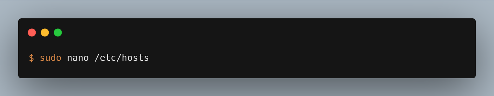
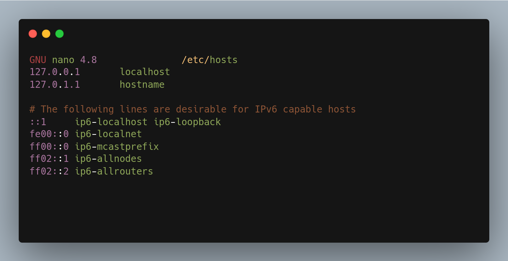
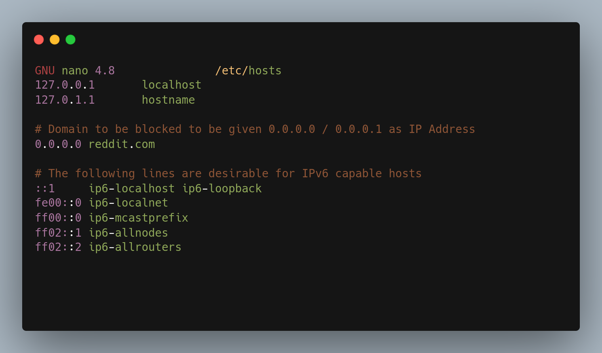
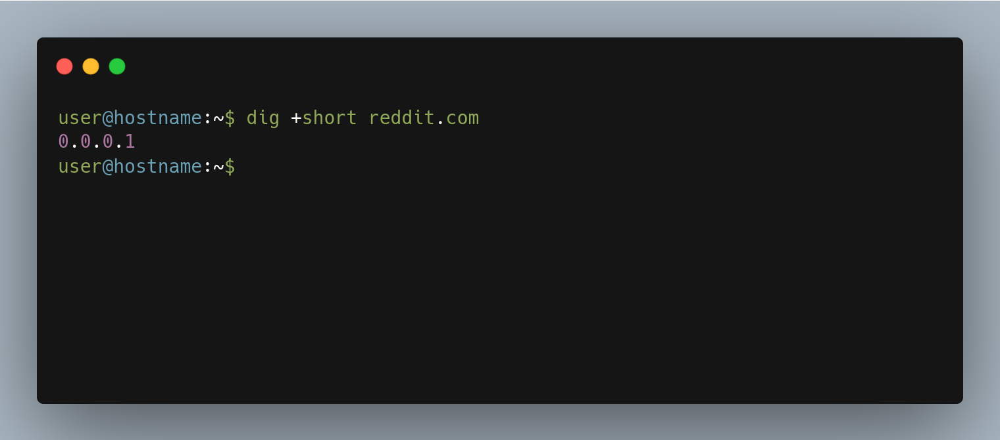

### Objective
To block domains using the /etc/hosts file.
***
### How
The `/etc/hosts` file contains the IP host names and addresses for the local host and other hosts in the internet network[^1]. 

This works by specifying 0.0.0.0 / 0.0.0.1 as IP address for the hostname explicitly in the /etc/hosts file.

So the resolver will use IP address specified in this file instead.
***
### Steps
1.	Open terminal and run the following command:

2.	Give 0.0.0.0/0.0.0.1 as IP address for domain that you want to block.

3. Verify using dig:

4. Restart browser if domain remains unblocked.

[^1]:https://www.ibm.com/docs/en/aix/7.2?topic=formats-hosts-file-format-tcpip
