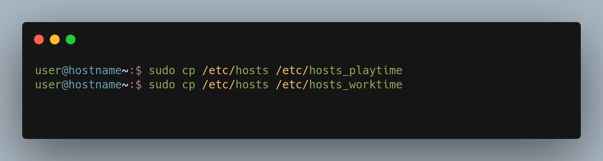
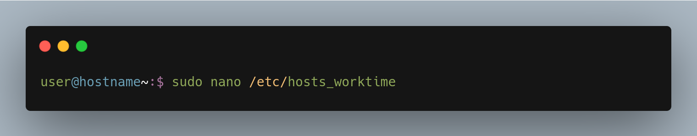
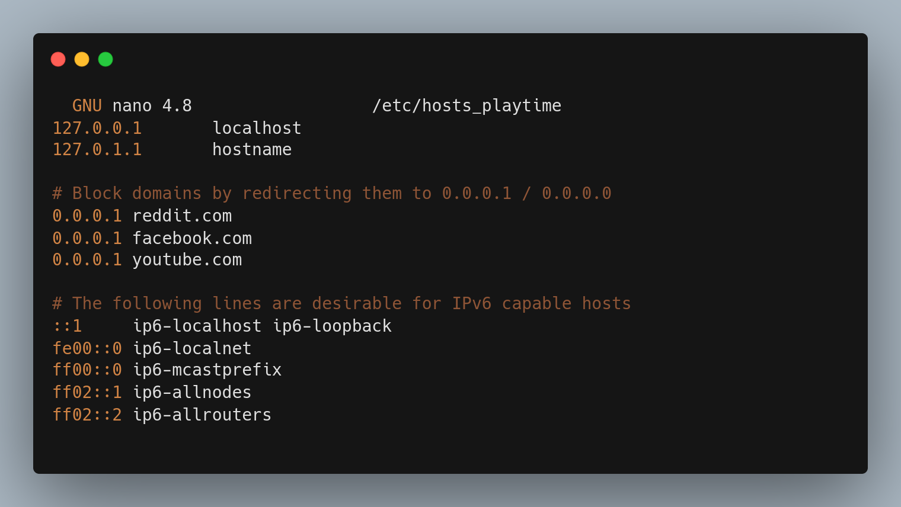
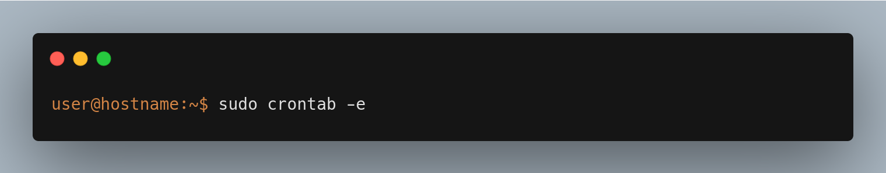
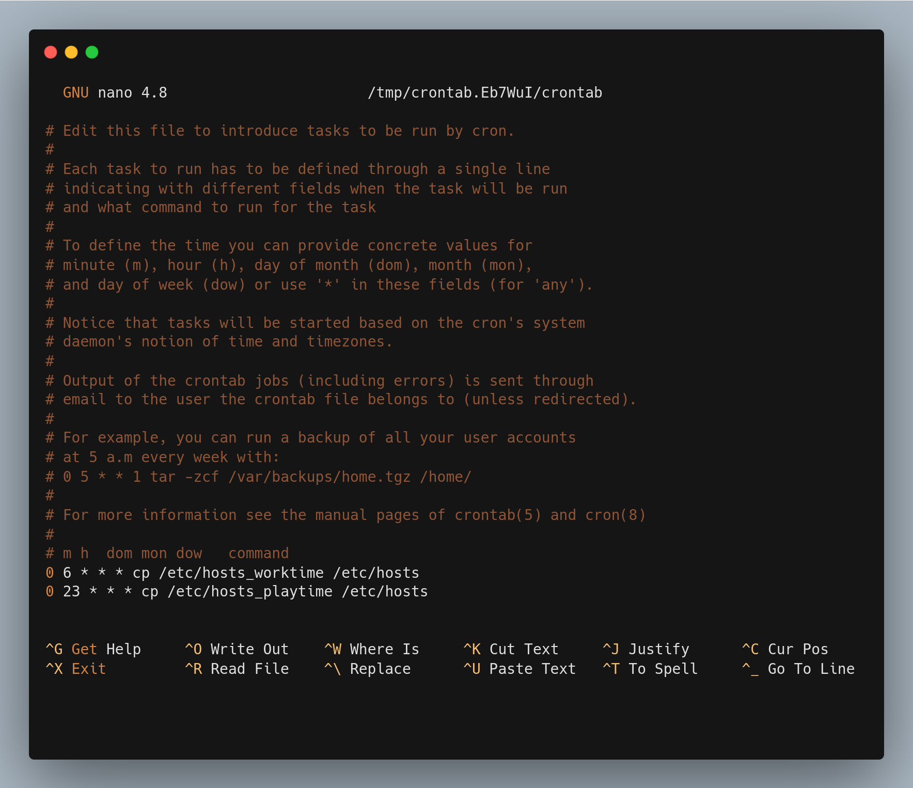
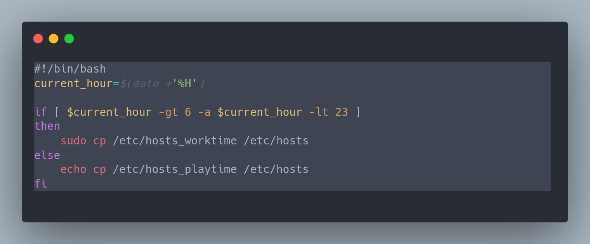
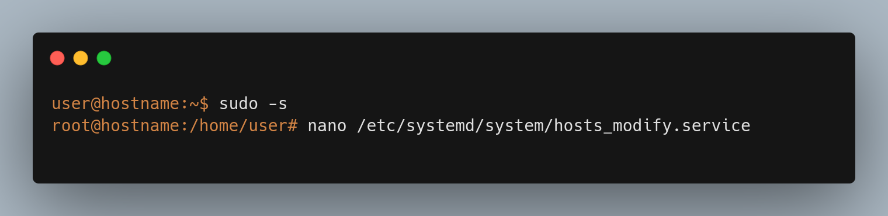
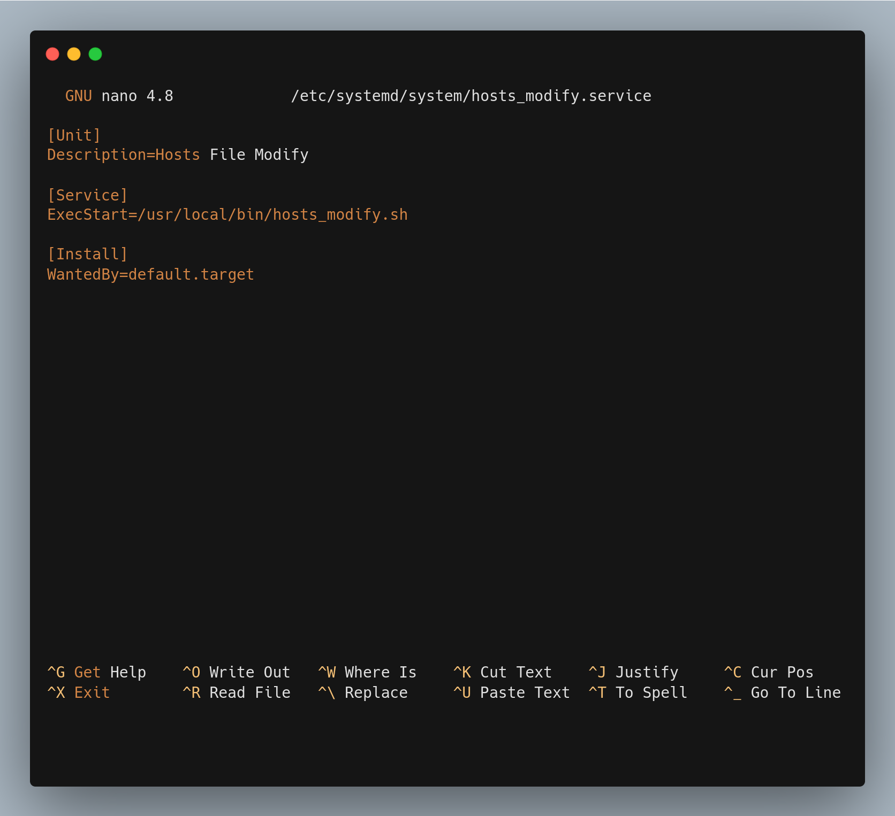
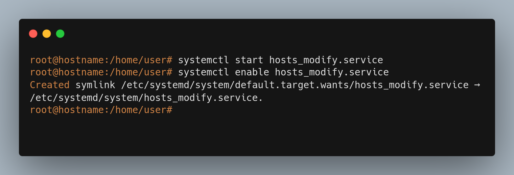

### Objective
To block domains based on time using /etc/hosts file.
***
### How
This involves 3 tasks:
1.	Create 2 `/etc/hosts` files. One of them should contain the domains to be blocked. The other is the default `/etc/hosts` file with no domains blocked.
2.	Let us say, domains need to be blocke from Time A to Time B. Use cron to schedule a task to copy the `domain-blocking /etc/hosts` file to `/etc/hosts` file at time A. At Time B, to undo this, copy the `default domain non-blocking /etc/hosts` file to `/etc/hosts` file.
3.	The cron will not be able to schedule the process if the machine was shut down at the time. For this, we create a script and run it as a service every time after the system boots.
***
### Steps
1.	Copy `/etc/hosts` to `/etc/hosts_playtime` and `/etc/hosts_worktime`. `/etc/hosts_worktime` will be the domain blocking `/etc/hosts` file. The other will serve as the default.

2.	Add domains to be blocked to `/etc/hosts_worktime` file.


3.	Edit crontab to schedule copying of `/etc/hosts_worktime` to `/etc/hosts`  at 6:00 AM and `/etc/hosts_playtime` to `/etc/hosts` at 11:00 PM.


4.	Create a bash script `/usr/local/bin/hosts_modify.sh` . The script copies `/etc/hosts_worktime` to /etc/hosts if the current time is between 6 AM and 11 PM.

Code
	```bash
	#!/bin/bash

	current_hour=$(date +'%H')

	if [ $current_hour -gt 6 -a $current_hour -lt 23 ]
	then
		sudo cp /etc/hosts_worktime /etc/hosts
	else
		echo cp /etc/hosts_playtime /etc/hosts
	fi
	```
5.	Create `/etc/systemd/system/hosts_modify.service` to run the `hosts_modify.sh` script.


6. Start the service and enable it to run it at boot.

